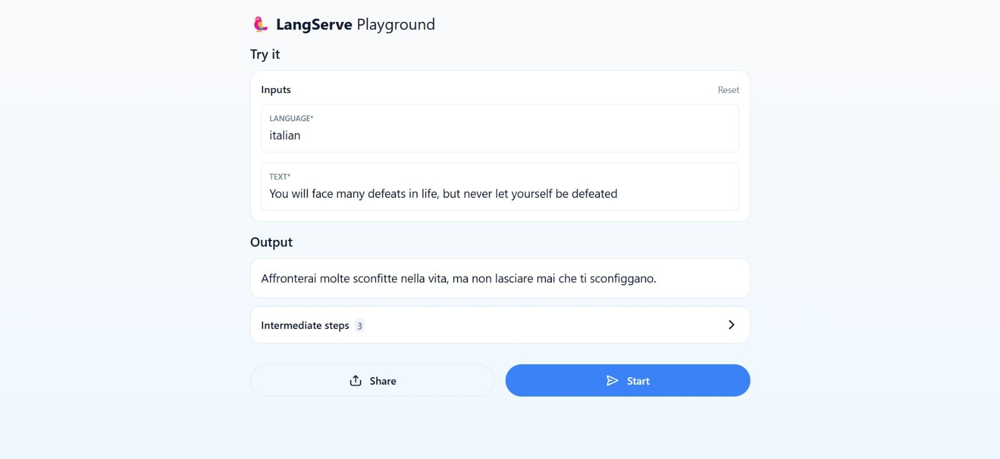

# Build a Simple LLM Application with LCEL

In this quickstart guide, we’ll show you how to build a simple LLM (Large Language Model) application using LangChain. This application translates text from English into another language. Though simple, it’s a great starting point for understanding LangChain's core features, as many applications can be built with just a prompt and an LLM call.

After completing this tutorial, you’ll gain a high-level overview of:

- Using language models
- Working with PromptTemplates and OutputParsers
- Chaining components together using LangChain Expression Language (LCEL)
- Debugging and tracing your application using LangSmith
- Deploying your application with LangServe

Let’s dive in!

## Setup

### Jupyter Notebook
This guide is best followed in a Jupyter Notebook, as it allows interactive learning and experimentation. See [Jupyter Notebook installation](https://jupyter.org/install) for setup instructions.

## Installation

### Install LangChain
To install LangChain, run:
```bash
pip install langchain
```
For more details, check the [Installation Guide](https://python.langchain.com/docs/get_started/installation/).

### LangSmith
LangSmith is used to trace and debug applications with multiple LLM calls. After signing up, set the environment variables to enable tracing:

```bash
export LANGCHAIN_TRACING_V2="true"
export LANGCHAIN_API_KEY="..."
```

In a Jupyter Notebook, use:
```python
import os
import getpass

os.environ["LANGCHAIN_TRACING_V2"] = "true"
os.environ["LANGCHAIN_API_KEY"] = getpass.getpass()
```

## Using Language Models

LangChain supports various language models. For this guide, we’ll use OpenAI's GPT-4 model.

### Install OpenAI API
```bash
pip install langchain-openai
```

### Example Code
```python
from langchain_openai import ChatOpenAI
from langchain_core.messages import HumanMessage, SystemMessage

model = ChatOpenAI(model="gpt-4")
messages = [
    SystemMessage(content="Translate the following from English into Italian"),
    HumanMessage(content="hi!"),
]

response = model.invoke(messages)
print(response)
```

## OutputParsers

To parse the model's response, use `StrOutputParser`:

```python
from langchain_core.output_parsers import StrOutputParser

parser = StrOutputParser()
parsed_response = parser.invoke(response)
print(parsed_response)
```

You can also chain the model and parser:

```python
chain = model | parser
result = chain.invoke(messages)
print(result)
```

## Prompt Templates

Use `PromptTemplates` to format user input and system messages:

```python
from langchain_core.prompts import ChatPromptTemplate

system_template = "Translate the following into {language}:"
prompt_template = ChatPromptTemplate.from_messages([
    ('system', system_template),
    ('user', '{text}')
])

formatted_prompt = prompt_template.invoke({"language": "italian", "text": "hi"})
print(formatted_prompt)
```

## Chaining Components with LCEL

Combine components using the LCEL pipe (`|`) operator:

```python
chain = prompt_template | model | parser
print(chain.invoke({"language": "italian", "text": "hi"}))
```

## Serving with LangServe

Use LangServe to deploy your application as an API.

### Install LangServe
```bash
pip install "langserve[all]"
```

### Create a Server Script
In a new Python file (e.g., `serve.py`):

```python
#!/usr/bin/env python
from fastapi import FastAPI
from langchain_core.prompts import ChatPromptTemplate
from langchain_core.output_parsers import StrOutputParser
from langchain_community.chat_models import ChatOpenAI
from langserve import add_routes

# Prompt template
system_template = "Translate the following into {language}:"
prompt_template = ChatPromptTemplate.from_messages([
    ('system', system_template),
    ('user', '{text}')
])

# Model and parser
model = ChatOpenAI()
parser = StrOutputParser()

# Chain
chain = prompt_template | model | parser

# FastAPI app
app = FastAPI(title="LangChain Server", version="1.0",
              description="A simple API server using LangChain's Runnable interfaces")

# Adding chain route
add_routes(app, chain, path="/chain")

if __name__ == "__main__":
    import uvicorn
    uvicorn.run(app, host="localhost", port=8000)
```

### Run the Server
```bash
python serve.py
```

Access the server at [http://localhost:8000/chain](http://localhost:8000/chain).

## Playground
Each LangServe deployment includes a playground UI at [http://localhost:8000/chain/playground/](http://localhost:8000/chain/playground/).


## Client Setup
You can interact with the API programmatically using `langserve.RemoteRunnable`:

```python
from langserve import RemoteRunnable

remote_chain = RemoteRunnable("http://localhost:8000/chain/")
print(remote_chain.invoke({"language": "italian", "text": "hi"}))
```


## Diagrama de Arquitectura


1. **Usuario** envía una solicitud de traducción al **Cliente**.
2. **Cliente** envía la solicitud al **Servidor FastAPI** en el endpoint `/chain`.
3. El **Servidor FastAPI** usa la cadena de **LangChain**:
   - **PromptTemplate** formatea la solicitud de traducción.
   - **ChatOpenAI** procesa el texto para la traducción.
   - **OutputParser** toma la salida generada y extrae el contenido relevante.
4. **LangSmith** registra el seguimiento de cada paso.
5. El **Servidor FastAPI** envía la respuesta al **Cliente**, que muestra el resultado al **Usuario**.


## Conclusion

In this guide, you learned to create a basic LLM application, work with language models, parse outputs, use prompt templates, chain components with LCEL, trace applications with LangSmith, and deploy with LangServe.

